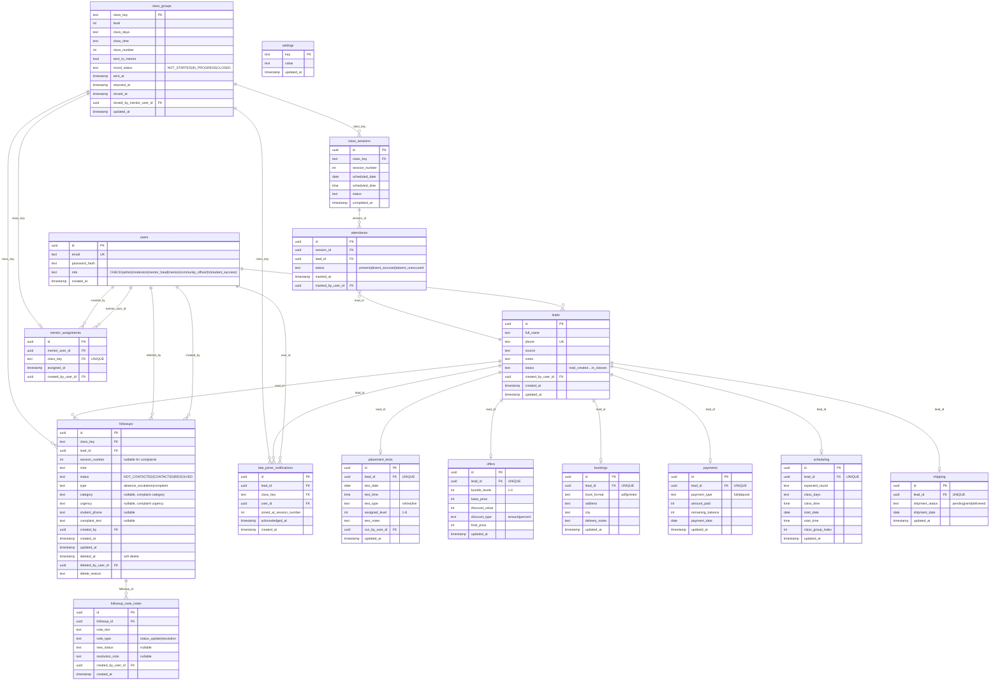

# Database ERD

**Purpose**: Visual map of core database tables and relationships.

**Evidence Sources**:  
- `migrations/001_init.sql` - Core tables (users, leads, placement_tests, etc.)
- `migrations/004_classes_board.sql` - Settings table
- `migrations/005_class_groups_workflow.sql` - class_groups table
- `migrations/022_create_mentor_assignments.sql` - mentor_assignments table
- `migrations/029_create_followups_table.sql` - followups table
- `migrations/033_add_complaints_to_followups.sql` - Complaint fields

---

## Entity Relationship Diagram

---

## Migration Evidence

| Table | Created In | Modified In |
|-------|------------|-------------|
| `users` | `001_init.sql:4-10` | `014_add_mentor_roles.sql`, `023_add_hr_role.sql`, `028_add_student_success_role.sql`, `035_add_manager_role.sql` |
| `leads` | `001_init.sql:13-26` | `004_classes_board.sql` (added `in_classes` status), `013_add_paused_status.sql` (added `paused`) |
| `placement_tests` | `001_init.sql:29-39` | `003_assigned_level_1_to_8.sql` (changed level constraint 1-4 → 1-8) |
| `offers` | `001_init.sql:42-51` | - |
| `bookings` | `001_init.sql:54-62` | - |
| `payments` | `001_init.sql:65-73` | - |
| `scheduling` | `001_init.sql:76-85` | `004_classes_board.sql:9` (added `class_group_index`) |
| `shipping` | `001_init.sql:88-94` | - |
| `settings` | `004_classes_board.sql:12-16` | - |
| `class_groups` | `005_class_groups_workflow.sql:2-12` | `027_class_groups_round_status.sql` (added round_status, closed_at, closed_by_mentor_user_id), `032_add_closed_mentor_user_id.sql` |
| `class_sessions` | `016_create_class_sessions.sql` | - |
| `attendance` | `017_create_attendance.sql` | `030_refine_attendance_and_followups.sql` |
| `mentor_assignments` | `022_create_mentor_assignments.sql:3-10` | - |
| `followups` | `029_create_followups_table.sql:2-13` | `030_refine_attendance_and_followups.sql`, `033_add_complaints_to_followups.sql` (added type, category, urgency, student_phone, complaint_text, deleted_at, deleted_by_user_id, delete_reason), `036_make_followups_nullable_for_complaints.sql` |
| `followup_case_notes` | `034_create_followup_case_notes.sql` | - |
| `late_joiner_notifications` | `044_late_joiner_notifications.sql` | - |

---

## Key Constraints & Indexes

### Foreign Keys
- All `*_by_user_id` fields → `users(id)`
- Most tables have `lead_id FK → leads(id) ON DELETE CASCADE`
- `mentor_assignments.mentor_user_id` → `users(id) ON DELETE CASCADE`
- `mentor_assignments.class_key` → `class_groups(class_key) ON DELETE CASCADE`
- `attendance.session_id` → `class_sessions(id)`
- `followups.lead_id` → `leads(id) ON DELETE CASCADE`
- `followup_case_notes.followup_id` → `followups(id) ON DELETE CASCADE`

### Unique Constraints
- UNIQUE per lead: `placement_tests.lead_id`, `offers.lead_id`, `bookings.lead_id`, `payments.lead_id`, `scheduling.lead_id`, `shipping.lead_id`
- UNIQUE: `mentor_assignments(class_key)` - One mentor per class
- UNIQUE: `followups(class_key, lead_id, session_number)` - One follow-up per absence instance

### Check Constraints
**Evidence**: Inline in CREATE TABLE statements

- `users.role` must be one of: admin, moderator, community_officer, mentor_head, mentor, hr, student_success *(manager was added and removed)*
- `leads.status` has extensive pipeline states (lead_created → in_classes)
- `placement_tests.assigned_level` must be 1-8 *(changed from 1-4)*
- `placement_tests.test_type` must be online or live
- `offers.discount_type` must be amount or percent
- `bookings.book_format` must be pdf or printed
- `payments.payment_type` must be full or deposit
- `shipping.shipment_status` must be pending, sent, or delivered
- `attendance.status` must be present, absent_excused, or absent_unexcused
- `class_groups.round_status` must be NOT_STARTED, IN_PROGRESS, or CLOSED
- `followups.status` must be NOT_CONTACTED, CONTACTED, or RESOLVED
- `followups.type` must be absence_escalation or complaint

### Performance Indexes
**Evidence**: `001_init.sql:97-100`, other migrations

- `idx_leads_status ON leads(status)`
- `idx_leads_phone ON leads(phone)`
- `idx_leads_created_at ON leads(created_at)`
- `idx_users_email ON users(email)`
- `idx_scheduling_class_group ON scheduling(class_days, class_time, class_group_index)`
- `idx_class_groups_key ON class_groups(class_key)`
- `idx_mentor_assignments_mentor_user_id ON mentor_assignments(mentor_user_id)`
- `idx_mentor_assignments_class_key ON mentor_assignments(class_key)`
- `idx_followups_class_key ON followups(class_key)`
- `idx_followups_lead_id ON followups(lead_id)`
- `idx_followups_type_status ON followups(type, status)`
- `idx_followups_deleted_at ON followups(deleted_at)`
- `idx_followups_student_phone ON followups(student_phone)`

---

## Notes

### Soft Delete Pattern
**Evidence**: `033_add_complaints_to_followups.sql:14-16`

`followups` table supports soft deletion via:
- `deleted_at` timestamp
- `deleted_by_user_id` UUID
- `delete_reason` TEXT

This was added for manager role (now removed) but the schema remains.

### Dual-Purpose followups Table
**Evidence**: `033_add_complaints_to_followups.sql`

The `followups` table serves two purposes:
1. **Absence escalations** (`type = 'absence_escalation'`) - Student Success workflow
2. **Complaints** (`type = 'complaint'`) - Complaint workflow

Complaint-specific fields (category, urgency, student_phone, complaint_text) are nullable and only used for complaint records.

### Session Numbering
**Evidence**: `036_make_followups_nullable_for_complaints.sql`

- Absence escalations: `session_number` is NOT NULL (tracks which session student missed)
- Complaints: `session_number` is NULL (not tied to specific session)
