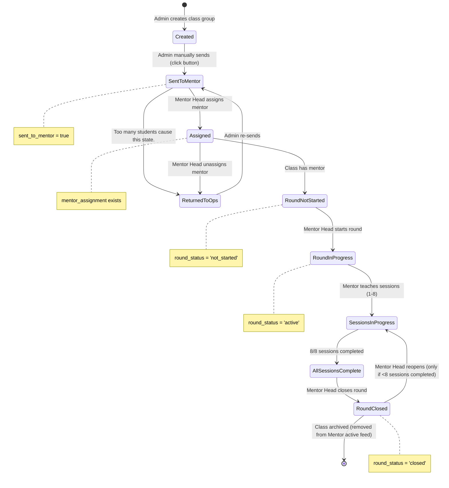

# Class Lifecycle Workflow

**Purpose**: Shows how a class moves through states from creation → closed.

**Evidence Sources**:
- `migrations/005_class_groups_workflow.sql` - class_groups table
- `migrations/027_class_groups_round_status.sql` - round_status field
- `internal/handlers/api.go` - Handler functions
- `cmd/server/main.go` - Route definitions

---

## State Diagram

---

## Evidence

### State: Created
**How**: Admin creates class via `/classes` operations  
**Database**: `class_groups` record created with `sent_to_mentor = false`  
**Evidence**: 
- `migrations/005_class_groups_workflow.sql:2-12`
- Database schema has `sent_to_mentor BOOLEAN DEFAULT false`

### Transition: Admin sends to mentor head (Created → SentToMentor)
**Route**: `POST /classes/send`  
**Handler**: `classesHandler.SendToMentor`  
**Database**: Updates `class_groups.sent_to_mentor = true`, sets `sent_at` timestamp.  
**Effect**: 
- Makes the class visible in the Mentor Head's Learning dashboard. 
- Allows assignment of a mentor and starting the round.
- **In OP Admin Board**: The class **stays visible** throughout its lifecycle.
    - If `sent_to_mentor` is true: it becomes **semi-transparent (opacity: 0.55)** and controls are locked.
    - If `round_status` is 'active': it shows a **Blue "STARTED" badge** and remains locked for editing to maintain sync with the active round. This ensures Ops admins can always see the status of students after they join classes.
**Evidence**:
- `internal/views/classes.html:52, 156-162` (CSS opacity and locked controls)
- `internal/handlers/classes.go:215` - calls `models.SendClassGroupToMentor`

### Visibility Note: Closed classes
**Important Rule**: The transition to `SentToMentor` is **strictly manual**. The `StartRound` action (incrementing round number) does **NOT** automatically send classes to the Mentor Head, regardless of student count. This ensures Ops Admin retains control over which classes are visible to mentors.

**Mentor Head dashboard**: Excludes classes with `round_status = 'closed'` even if `sent_to_mentor = true`.  
**Ops classes board**: Shows closed classes with a **CLOSED** badge and no return action.  
**Evidence**:
- `internal/models/repository.go` (`GetClassGroupsSentToMentor`)
- `internal/views/classes.html` (closed badge + messaging)

### Related Rule: Send-to-Classes (lead) does NOT join active rounds
**Scope**: Pre-Enrolment "Send to Classes" action (lead → classes board).  
**Behavior**: Assigns the lead to a non-started class group for the same level/days/time (or opens a new group if all are full).  
**Active rounds**: Joining a running class requires the Late Joiner flow; Send-to-Classes should not place students into `round_status = 'active'` groups.  
**Closed/sent groups**: Send-to-Classes must not assign into **closed** or **sent_to_mentor** groups (ops can only add to ops-owned, not-started groups).  
**Evidence**: `internal/models/repository.go` (`AssignClassGroup`, `MoveStudentBetweenGroups`), `internal/views/pre_enrolment_detail.html` note.

### Late Joiner Pre-Start Exception
**Scope**: Pre-Enrolment "Add as Late Joiner".  
**Behavior**:
- Eligible classes include:
  - `round_status = 'active'`, or
  - `sent_to_mentor = true` with `round_status = 'not_started'` (exception).
- Capacity gate remains `4-5` students.
- For the not-started exception path, system creates a Mentor Head only notification banner (dismissible).
- Ops class board roster must still include these late-joined students (status `in_classes`) while class is `sent_to_mentor + not_started`, to keep Ops/MH rosters consistent.

### Transition: Mentor Head assigns mentor (SentToMentor → Assigned)
**Route**: `POST /api/mentor-head/assign-mentor`  
**Handler**: `apiHandler.AssignMentor`  
**Database**: Creates record in `mentor_assignments` table  
**Evidence**:
- `cmd/server/main.go:147-154`
- `internal/handlers/api.go` - AssignMentor function
- `migrations/022_create_mentor_assignments.sql`

### Transition: Mentor Head starts round (RoundNotStarted → RoundInProgress)
**Route**: `POST /api/mentor-head/start-round`  
**Handler**: `apiHandler.StartRound`  
**Database**: Updates `class_groups.round_status = 'IN_PROGRESS'`  
**Prerequisite**: Mentor must be assigned before starting the round.  
**Evidence**:
- `cmd/server/main.go:183-190`
- `internal/handlers/api.go` - StartRound function
- `migrations/027_class_groups_round_status.sql` - Added round_status field

### State: Sessions In Progress
**How**: Mentor marks attendance and completes sessions (1-8)  
**Routes**: 
- `POST /api/attendance` (mark attendance)
- `POST /api/session/complete` (complete session)
- `POST /api/classes/:id/sessions/:n/complete` (complete by number)  
**Database**: 
- `attendance` records created
- `class_sessions.status` updated to 'completed'
- `class_sessions.completed_at` timestamp set  
**Evidence**:
- `cmd/server/main.go:104-112`, `391-406`
- `migrations/016_create_class_sessions.sql`
- `migrations/017_create_attendance.sql`

### Mentor Reminder System
**Purpose**: Persistent reminders for mentors to complete critical tasks  
**Triggers**:
- **Attendance Reminder**: Session marked completed but attendance incomplete
- **Grading Reminder**: All 8 sessions completed but grades missing  
**Behavior**: 
- Appears on mentor dashboard login
- Auto-dismisses after 10 seconds
- Reappears on next login if task still incomplete
- Click to navigate directly to class workspace  
**Route**: `GET /api/mentor/reminders`  
**Evidence**: `internal/models/repository.go` (GetMentorReminders), `internal/handlers/api.go`, `frontend/src/components/MentorReminderBanner.tsx`

### Transition: Mentor Head closes round (AllSessionsComplete → RoundClosed)
**Route**: `POST /api/mentor-head/close-round`  
**Handler**: `apiHandler.CloseRound`  
**Database**: Updates `class_groups.round_status = 'CLOSED'`, sets `closed_at` timestamp, sets `closed_by_mentor_user_id`  
**Prerequisite**: All students must have a grade recorded for session 8; otherwise, an error is returned and the round remains open.  
**Roster Scope**: Grade completeness is checked against the active class roster (`in_classes`) for that class key, not against unrelated leads sharing the same schedule metadata.
**Grading Source**:
- Mentors save final grades from automated breakdown (attendance + tasks + participation).
- Mentor submissions are validated against calculated grade.
- Mentor Head can override when needed.
**Evidence**:
- `cmd/server/main.go:201-208`
- `internal/handlers/api.go` - CloseRound function
- `internal/models/repository.go` - CloseRound validation logic
- `migrations/027_class_groups_round_status.sql:5-7` - Added closed_at, closed_by_mentor_user_id
- `migrations/032_add_closed_mentor_user_id.sql`

**Outcome Side Effects**:
- Writes `class_enrollments.outcome` = `promoted` or `repeated`
- Sets lead status to `waiting_for_round` or `renewal_pending` based on credits **before** the promotion deduction
- Updates `leads.remaining_credits` from `levels_purchased_total - levels_consumed`, then subtracts 1 if outcome is promoted
- Clears current Offer/Payment snapshots for returning students (next cycle starts clean)
- Marks the start of a new payment cycle at the latest class completion (used to calculate current‑cycle balance)
- Returns to Ops with default schedule prefilled from previous class (returning students)

**Renewal Flow**:
- `renewal_pending` students auto-transition to `offer_sent` when Ops Admin saves an offer
- This provides visual feedback that the offer has been sent and allows filtering by status
- Manual `Move to Waiting List` is blocked for leads without prepaid entitlement (prevents bypass from `renewal_pending` to `ready_to_start`)

**Ops Visibility**:
- Pre‑enrolment list can filter Repeat Level and shows REPEAT badge from latest class outcome

### Archived Classes Filter (Mentor Head)
**Route**: `GET /api/mentor-head/archive`  
**Filters**: Optional `from` and `to` (YYYY-MM-DD) to filter by `round_closed_at` date (inclusive).  
**Sort**: `sort=oldest|newest` on `round_closed_at`.  
**Evidence**: `internal/handlers/api.go` (`GetMentorHeadArchive`), `internal/models/repository.go` (`GetArchivedClassGroups`).

### Mentor Head dashboard banner UX
**Scope**: `/mentor-head` (server-rendered)  
**Behavior**: Handler redirects with `?error=...` or `?success=...`, template renders a banner  
**Evidence**:
- `internal/handlers/mentor_head.go`
- `internal/views/mentor_head.html`

### Transition: Return to Ops (SentToMentor/Assigned → ReturnedToOps)
**Route**: `POST /api/mentor-head/return-to-ops` or `POST /classes/return`  
**Handler**: `apiHandler.ReturnToOps` or `classesHandler.ReturnFromMentor`  
**Database**: Updates `class_groups.sent_to_mentor = false`, sets `returned_at` timestamp  
**Guard**: Class cannot be returned if `round_status = 'active'` (started rounds must be closed or archived, not returned).  
**Evidence**:
- `cmd/server/main.go:156-163` (mentor-head)
- `cmd/server/main.go:567-581` (admin)
- `internal/handlers/api.go` - ReturnToOps function

### Transition: Mentor Head unassigns mentor (Assigned → ReturnedToOps)
**Route**: `POST /api/mentor-head/unassign`  
**Handler**: `apiHandler.UnassignMentor`  
**Database**: Deletes record from `mentor_assignments`, updates `class_groups.sent_to_mentor = false`  
**Evidence**:
- `cmd/server/main.go:174-181`
- `internal/handlers/api.go` - UnassignMentor function

---

## Key Business Rules

### Rule: One mentor per class
**Evidence**: `migrations/022_create_mentor_assignments.sql:9`  
**Constraint**: `UNIQUE (class_key)` on `mentor_assignments` table

### Rule: Round status progression
**Evidence**: `migrations/027_class_groups_round_status.sql`  
**States**: not_started → active → closed  
**CHECK constraint**: `round_status IN ('not_started', 'active', 'closed')`

### Rule: 8 sessions per class
**Evidence**: `migrations/016_create_class_sessions.sql`  
**Implementation**: When class is created, 8 session records are initialized  
**TODO**: Verify exact session creation logic in handlers

### Rule: Can only close round after all sessions complete
**Evidence**: Handler logic (TODO: verify in `internal/handlers/api.go` - CloseRound)  
**Expected behavior**: Frontend/backend should check all 8 sessions are completed before allowing close.

### Rule: Reopen closed round only if fewer than 8 sessions completed
**Evidence**:
- `internal/handlers/api.go` - `ReopenRound` handler
- `internal/models/repository.go` - `ReopenClosedRound` (counts completed sessions < 8)
- `cmd/server/main.go` - `/api/mentor-head/reopen-round` route

### Rule: Active Classes Feed Filtering
**Implementation**: 
- **Mentor/Mentor-Head Views**: Classes are visible only when `sent_to_mentor = true` and not closed.
- **Student Success Views**: Should only show classes when **Mentor Head has started the round** (`round_status = 'active'`) **and** `sent_to_mentor = true`.
- **OP Admin Classes Board**: Classes remain visible even after they start (`round_status = 'active'`) with a blue **STARTED** badge, but they are read-only to prevent out-of-sync roster mid-round.
- **OP Admin Archive**: Admin can hide classes from the Ops board **only if** `sent_to_mentor = true` **and** `round_status = 'active'`. Archived classes are reversible via Ops archive view (filterable by class_key and date).
**Evidence**: `models.GetClassGroups`, `models.GetClassGroupsSentToMentor`, `models.GetMentorClasses`, `internal/views/classes.html`

---

## Open Questions

- [ ] **Session creation timing**: When are the 8 `class_sessions` records created? At class creation? At round start? *(check handler code)*
- [ ] **Return to ops conditions**: What are the exact conditions that trigger return to ops? *(check business logic)*
- [ ] **Unassign vs return**: What's the difference between unassigning mentor vs returning class to ops? *(seems overlapping)*
- [ ] **Round restart**: Can a closed round be restarted? *(database allows, but is it exposed in UI?)*
