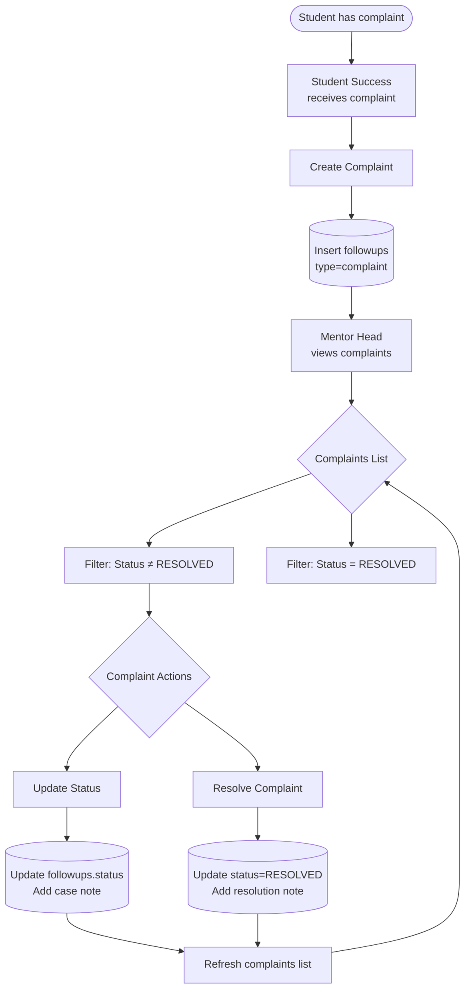
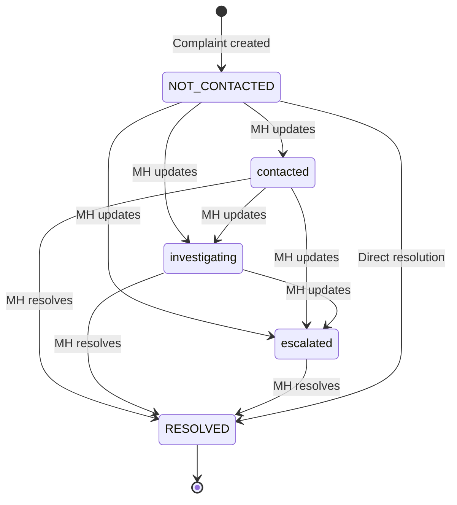

# Complaints Workflow

**Purpose**: Shows complaint creation and resolution flow (Student Success → Mentor Head).

**Evidence Sources**:
- `frontend/src/components/MentorHeadComplaints.tsx` - Mentor Head complaint UI
- `internal/handlers/api.go` - API handlers
- `migrations/033_add_complaints_to_followups.sql` - Complaint fields in followups
- `cmd/server/main.go` - Route definitions

---

## Complaint Workflow Diagram

---

## Evidence

### Create Complaint (Student Success)
**Route**: `POST /api/student-success/complaints`  
**Handler**: `apiHandler.CreateComplaint`  
**Payload**: `{ student_phone, category, urgency, complaint_text, note }`  
**Database**: Inserts `followups` WHERE:
- `type = 'complaint'`
- `session_number = NULL`
- Complaint-specific fields populated  
**Evidence**:
- `cmd/server/main.go:344-347`
- `migrations/033_add_complaints_to_followups.sql:5-11`
- `internal/handlers/api.go` - CreateComplaint function

### View Complaints (Mentor Head)
**Route**: `GET /api/mentor-head/complaints`  
**Handler**: `apiHandler.GetMentorHeadComplaints`  
**Returns**: List of all complaints (followups WHERE type = 'complaint')  
**Filtering**: Frontend can filter by status (resolved vs unresolved)  
**Evidence**:
- `cmd/server/main.go:350-357`
- `frontend/src/components/MentorHeadComplaints.tsx` - UI with "Show Resolved" toggle
- `internal/handlers/api.go` - GetMentorHeadComplaints function

### Update Complaint Status (Mentor Head)
**Route**: `POST /api/mentor-head/complaints/:id/update`  
**Handler**: `apiHandler.UpdateComplaintStatusHandler`  
**Payload**: `{ status, note }`  
**Database**: 
- Updates `followups.status` (e.g., CONTACTED, contacted|investigating|escalated)
- Inserts `followup_case_notes` with note_type = 'status_update'  
**Evidence**:
- `cmd/server/main.go:360-375`
- `internal/handlers/api.go` - UpdateComplaintStatusHandler function

### Resolve Complaint (Mentor Head)
**Route**: `POST /api/mentor-head/complaints/:id/resolve`  
**Handler**: `apiHandler.ResolveComplaintHandler`  
**Payload**: `{ resolution_note }`  
**Database**:
- Updates `followups.status = 'RESOLVED'`
- Inserts `followup_case_notes` with note_type = 'resolution', resolution_note populated  
**Evidence**:
- `cmd/server/main.go:360-375`
- `migrations/034_create_followup_case_notes.sql`
- `internal/handlers/api.go` - ResolveComplaintHandler function

---

## Complaint Status Flow

### Evidence:
- Status values are string-based (not constrained like absence escalations)
- Frontend shows: contacted, investigating, escalated as intermediate states
- Final state: RESOLVED

---

## Complaint Fields

### Fields in followups table
**Evidence**: `migrations/033_add_complaints_to_followups.sql:8-11`

| Field | Purpose | Example |
|-------|---------|---------|
| `type` | 'complaint' (vs 'absence_escalation') | 'complaint' |
| `student_phone` | Contact info | '+20123456789' |
| `category` | Complaint type | 'mentor', 'content', 'technical' |
| `urgency` | Priority level | 'low', 'medium', 'high' |
| `complaint_text` | Detailed description | 'The mentor was rude...' |
| `note` | Initial SS note | 'Student called upset' |
| `session_number` | NULL for complaints | NULL |

---

## Key Business Rules

### Rule: Complaints are dual-purpose followups
**Design**: Reuses `followups` table with `type = 'complaint'`  
**Why**: Shares status tracking, case notes, resolution flow  
**Difference**: Complaints have extra fields (category, urgency, student_phone, complaint_text)  
**Evidence**: `migrations/033_add_complaints_to_followups.sql`

### Rule: Session number is nullable for complaints
**Constraint**: Complaints don't link to specific sessions  
**Migration**: `036_make_followups_nullable_for_complaints.sql`  
**Evidence**: session_number field made nullable to support complaints

### Rule: Only Mentor Head can handle complaints
**Routes**: `/api/mentor-head/complaints/*`  
**Roles**: mentor_head, admin  
**Student Success**: Can create but not resolve  
**Evidence**: `cmd/server/main.go:350-375` - RequireAnyRole checks

### Rule: Soft delete support (unused)
**Fields**: `deleted_at`, `deleted_by_user_id`, `delete_reason`  
**Purpose**: Was for manager role to delete inappropriate complaints  
**Status**: Manager role removed, fields remain unused  
**Evidence**: `migrations/033_add_complaints_to_followups.sql:14-16`

---

## Frontend UI Features

### Evidence: `frontend/src/components/MentorHeadComplaints.tsx`

- Shows table of complaints with columns: Student Phone, Category, Urgency, Status, Complaint, Created At
- "Show Resolved" toggle to filter resolved vs unresolved
- Actions per complaint:
  - **Unresolved**: Update button, Resolve button
  - **Resolved**: No actions (was Delete button for manager, now removed)
- Update modal: Change status + add note
- Resolve modal: Add resolution note

---

## Open Questions

- [ ] **Category values**: What are valid category values? *(not constrained in DB, check frontend)*
- [ ] **Urgency levels**: What urgency levels exist? *(not constrained in DB, check frontend)*
- [ ] **Status intermediate values**: Are contacted/investigating/escalated the only intermediate states? *(check frontend dropdown)*
- [ ] **Complaint routing**: How does SS determine which complaints go to Mentor Head vs escalate elsewhere? *(check business logic)*
