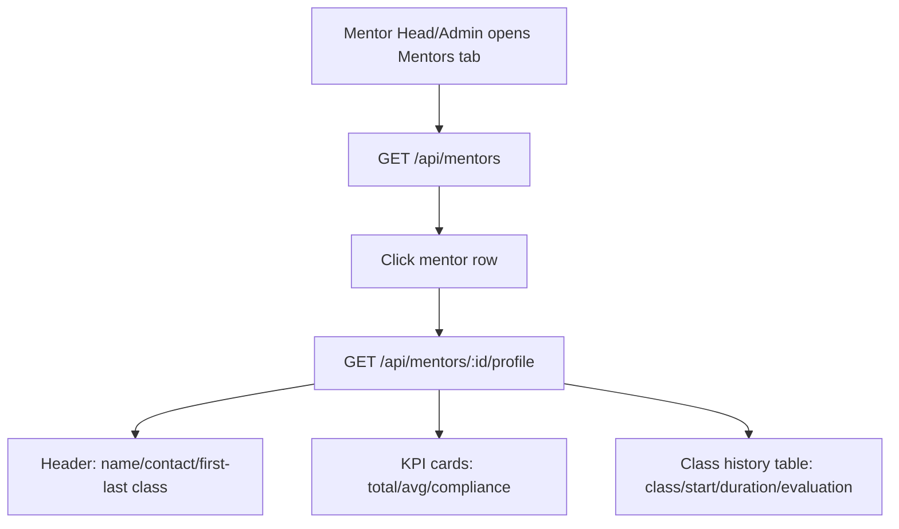

# Mentor Profile Workflow

**Purpose**: Mentor Directory + Mentor Profile data mapping and UI flow for Mentor Head/Admin views.

**Status**: Implemented (backend + frontend).

---

## Data Sources (Implemented)

- `users`: mentor identity (`role='mentor'`)
- `mentor_assignments`: mentor ↔ class mapping + `assigned_at` timeline
- `class_groups`: class metadata and lifecycle (`round_started_at`, `round_closed_at`, `round_status`)
- `mentor_evaluations`: manual per-class metrics (`kpi_session_quality`, `kpi_students_feedback`, `trello_session_checks`)
- `class_sessions` + `mentor_session_checks`: automatic compliance/punctuality inputs

---

## Query Logic (Implemented)

### 1) First/Last Class Dates

For one `mentor_user_id`, use assignment history:

- Source class set = union of:
  - `mentor_assignments.class_key` (currently assigned)
  - `class_groups.class_key` where `closed_mentor_user_id = mentor_user_id` (closed by mentor)
- `first_class_date` / `last_class_date` are derived from class start anchor:
  - `COALESCE(round_started_at, sent_at, assigned_at, round_closed_at)`

### 2) Class Duration

Per mentor class (from union source):

- `start_date = COALESCE(class_groups.round_started_at, class_groups.sent_at, mentor_assignments.assigned_at)`
- `end_date = class_groups.round_closed_at` (nullable)
- If `end_date IS NULL` -> `"Ongoing"`
- Else backend returns humanized duration (`N days` / `N months` / `N years`).

### 3) Evaluations + Collective KPI per Class

Manual metrics (from `mentor_evaluations`):
- `session_quality` (1-10)
- `students_feedback` (1-10)
- `trello_session_checks` (8 booleans -> percent checked)

Automatic metrics (from `mentor_session_checks` via class sessions):
- WhatsApp Management percent:
  - `(sum(reminder_1d + reminder_1h + reminder_tasks true) / (checks_count * 3)) * 100`
- Attendance Punctuality percent:
  - `equivalent_absences = absent_count + floor(delayed_sessions/2)` where delayed session = `delay_minutes > 0`
  - `punctuality = ((8 - equivalent_absences)/8) * 100`

Weighted collective score (per class):
- Punctuality 25%
- Session Quality 25% (`session_quality * 10`)
- Feedback 20% (`students_feedback * 10`)
- WhatsApp 10%
- Trello 20%

---

## API Contract (Implemented)

### `GET /api/mentors`

Access: `mentor_head`, `admin`

Returns mentor directory list (used by `/mentors` page).

Name/phone source:
- `name` = `users.full_name` fallback to `users.email`
- `phone` = `users.phone` (backfilled for legacy mentor rows)

```json
{
  "mentors": [
    {
      "id": "uuid",
      "name": "mentor@email",
      "email": "mentor@email",
      "phone": "01012345678",
      "status": "active",
      "total_classes_taught": 12
    }
  ]
}
```

### `GET /api/mentors/:id/profile`

Access: `mentor_head`, `admin`

Returns mentor profile snapshot + class history + testimonials.

Implemented:
- `stats.feedback_meter` sourced from MH manual `students_feedback` (avg of class `kpi_students_feedback * 10`).
- Class history table includes `end_date` explicitly in UI (active classes show `-`).
- `testimonials` array (per mentor entries with source `class_key`).
- Historical class list no longer depends only on `mentor_assignments`; it also includes `closed_mentor_user_id` classes to preserve history after unassignment.

```json
{
  "mentor_details": {
    "id": "uuid",
    "name": "mentor@email",
    "email": "mentor@email",
    "phone": "01012345678",
    "status": "active"
  },
  "stats": {
    "total_classes": 12,
    "first_class_date": "2026-01-01T10:00:00Z",
    "last_class_date": "2026-02-01T10:00:00Z",
    "avg_rating": 74,
    "feedback_meter": 70,
    "compliance_score": 68
  },
  "class_history": [
    {
      "class_key": "L3|Sat/Tues|07:30:00|1",
      "level": 3,
      "days": "Sat/Tues",
      "time": "07:30:00",
      "start_date": "2026-01-01T10:00:00Z",
      "end_date": "2026-02-01T10:00:00Z",
      "duration": "1 month",
      "evaluation_score": 78,
      "compliance_score": 66
    }
  ],
  "testimonials": [
    {
      "id": "uuid",
      "class_key": "L3|Sat/Tues|07:30:00|1",
      "testimonial_text": "Strong mentor and very clear explanations.",
      "created_by": "mentorhead@eightytwenty.test",
      "created_at": "2026-02-13T12:00:00Z"
    }
  ]
}
```

### `POST /api/mentor-head/mentors/:id/testimonials`

Access: `mentor_head`, `admin`

Request:
- `class_key` (required)
- `testimonial_text` (required)

Behavior:
- Stores testimonial per mentor, while tracking source class for each testimonial.
- Created from Mentor Head "Mentor Evaluations" page via `Testimonials` action per mentor.

---

## Frontend Flow (Implemented)

- Sidebar:
  - New `Mentors` nav item added for `mentor_head` and `admin`.
  - Placed under `Reports`.
- Route:
  - `GET /app/mentors` renders `MentorsPage`.
- Directory view:
  - Columns: Name, Phone, Status, Total Classes Taught.
  - Clicking mentor row opens profile modal.
- Profile modal:
  - Header: mentor identity + first/last class pills.
  - KPI cards: Total Classes, Avg Evaluation, Compliance Score.
  - History table: Class label (Level + Days + Time), Start Date, Duration, Evaluation Score.

### UI Description Snapshot

- Left nav shows `Mentors` under `Reports`.
- Main content starts with `Mentor Directory`.
- Selecting a mentor opens an overlay modal with KPIs and class history.

---

## UI/Backend Mapping


