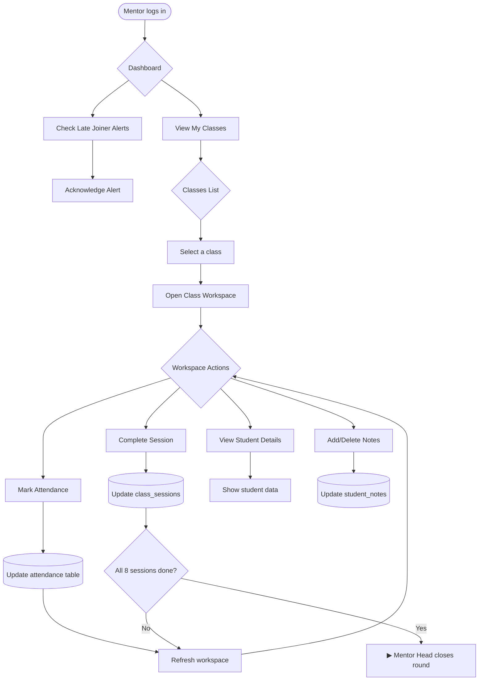
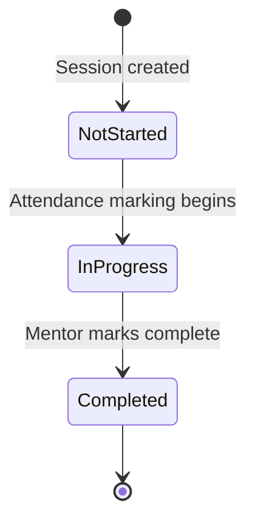

# Mentor Workflow

**Purpose**: Shows mentor's view and actions when teaching a class.

**Evidence Sources**:
- `frontend/src/pages/MentorDashboard.tsx` - Mentor UI
- `frontend/src/pages/ClassWorkspace.tsx` - Class workspace UI
- `internal/handlers/api.go` - API handlers
- `cmd/server/main.go` - Route definitions

---

## Workflow Diagram

---

## Evidence

### View My Classes
**Route**: `GET /api/mentor/classes`  
**Handler**: `apiHandler.GetMentorClasses`  
**Returns**: List of classes assigned to logged-in mentor  
**Database**: Queries `mentor_assignments` JOIN `class_groups` WHERE mentor_user_id = current_user  
**Evidence**:
- `cmd/server/main.go:114-117`
- `internal/handlers/api.go` - GetMentorClasses function
- `internal/handlers/mentor.go` - banner UX for server-rendered mentor pages

### Open Class Workspace
**Route**: `GET /api/class-workspace?class_key={key}`  
**Handler**: `apiHandler.GetClassWorkspace`  
**Returns**: Class details, students list, sessions list, attendance data  
**Evidence**:
- `cmd/server/main.go:210-222`
- `frontend/src/pages/ClassWorkspace.tsx` - UI component
- `internal/handlers/api.go` - GetClassWorkspace function

### Mark Attendance
**Route**: `POST /api/attendance`  
**Handler**: `apiHandler.MarkAttendance`  
**Payload**: `{ session_id, lead_id, status }`  
**Database**: Inserts/updates `attendance` table  
**Status values**: `present`, `absent_excused`, `absent_unexcused`  
**Evidence**:
- `cmd/server/main.go:104-107`
- `migrations/017_create_attendance.sql`
- `internal/handlers/api.go` - MarkAttendance function

### Complete Session
**Route**: `POST /api/session/complete` or `POST /api/classes/:id/sessions/:n/complete`  
**Handler**: `apiHandler.CompleteSession` or `apiHandler.CompleteSessionByNumber`  
**Database**: Updates `class_sessions.status = 'completed'`, sets `completed_at` timestamp  
**UI**: Uses a styled modal confirmation (replaces browser `confirm`)  
**Evidence**:
- `cmd/server/main.go:109-112`, `391-406`
- `migrations/016_create_class_sessions.sql`
- `internal/handlers/api.go` - CompleteSession, CompleteSessionByNumber functions
- `frontend/src/pages/ClassWorkspace.tsx` - modal confirmation

### View Student Details  
**Route**: `GET /api/student?lead_id={id}&class_key={key}`  
**Handler**: `apiHandler.GetStudent`  
**Returns**: Student profile, attendance history, notes, grades  
**Evidence**:
- `cmd/server/main.go:246-253`
- `internal/handlers/api.go` - GetStudent function

### Manage Notes
**Routes**:
- `GET /api/notes?lead_id={id}&class_key={key}` - List notes
- `POST /api/notes` - Create note
- `DELETE /api/notes?note_id={id}` - Delete note  

**Handler**: `apiHandler.GetNotes`, `CreateNote`, `DeleteNote`  
**Database**: `student_notes` table  
**Evidence**:
- `cmd/server/main.go:233-244`
- `migrations/019_create_student_notes.sql`
- `internal/handlers/api.go` - Note CRUD functions

---

## Key Business Rules

### Rule: Absence triggers follow-up
**When**: Mentor marks student as `absent_unexcused`  
**Action**: Student Success is notified via absence feed  
**Database Change**: Absence appears in absence feed query (TODO: verify exact trigger mechanism)  
**Evidence**:
- `migrations/029_create_followups_table.sql`
- Student Success can see absences and create follow-ups

### Rule: Session completion is tracked
**Mechanism**: Each class has 8 sessions (session_number 1-8)  
**Frontend Display**: Shows "Sessions X/8" badge  
**Database**: `class_sessions` table with status field  
**Evidence**:
- `migrations/016_create_class_sessions.sql`
- Frontend displays completion counter

### Rule: Attendance deadline enforced
**Rule**: Mentors can mark attendance up to 24 hours after scheduled session end time (Africa/Cairo)  
**Override**: Mentor Head, Admin, and Student Success can bypass for corrections  
**UI**: Mentor class workspace shows red banner for overdue missing attendance  
**Evidence**:
- `internal/models/repository.go` (ComputeSessionEndTime, MarkAttendance)
- `internal/handlers/mentor.go` / `internal/views/mentor_class_detail.html`
- `frontend/src/pages/ClassWorkspace.tsx`

### Rule: Mentor Task Reminders
**Rule**: Mentors see persistent banner alerts on their dashboard for incomplete critical tasks.  
**Trigger 1 (Attendance)**: Class session is completed but attendance hasn't been marked for all students.  
**Trigger 2 (Grading)**: Session 8 is completed but one or more students are missing their final grade.  
**Behavior**: Auto-dismisses after 10s; reappears on refresh; clickable to go straight to class workspace.  
**Evidence**: `internal/models/repository.go` (`GetMentorReminders`), `frontend/src/components/MentorReminderBanner.tsx`

### Rule: Attendance required before session completion
**Rule**: Sessions cannot be completed unless attendance is recorded for all applicable students  
**Excludes**: Late joiners for sessions before their join session  
**Evidence**: `internal/models/repository.go` (`CompleteSession`)

### Rule: Final grading highlights repeat risk
**Rule**: Students with more than 2 missed sessions must be highlighted during final grading  
**Reason**: 3+ absences triggers repeat outcome in round close rules  
**Evidence**: `internal/models/repository.go` (`CloseRound`), `frontend/src/pages/ClassWorkspace.tsx`

### Rule: Final grading edit roles
**Rule**: Only mentors and mentor heads can edit final grades. Student Success is read-only.  
**Evidence**:
- `internal/handlers/grades.go` (CreateGrade permission checks)
- `cmd/server/main.go` (`/api/grades` POST role gating)
- `frontend/src/pages/ClassWorkspace.tsx` (edit controls)
- `frontend/src/pages/StudentSuccessClass.tsx` (read-only controls)

### Rule: Close round requires final grading
**Rule**: Mentor Head cannot close the round until all students have final grades (session 8 grade).  
**Evidence**:
- `internal/handlers/api.go` (CloseRound grade checks)
- `internal/models/repository.go` (`CloseRound`) - validates grades for session 8 exist for all students.
- `frontend/src/pages/MentorHeadDashboard.tsx` (Close Round disabled until grades complete)

### Rule: Clearing a grade
**Rule**: Mentors and mentor heads can clear a final grade (delete session 8 grade) by selecting the default option.  
**Evidence**:
- `internal/handlers/grades.go` (DeleteGrade)
- `cmd/server/main.go` (`/api/grades` DELETE)
- `frontend/src/pages/ClassWorkspace.tsx` (grade clear UX)

### Rule: Mentor Head can view feedback collected in class workspace
**Rule**: Mentor Head has a read-only Feedback Collected tab in class workspace.  
**Evidence**:
- `frontend/src/pages/ClassWorkspace.tsx`
- `frontend/src/components/FeedbackCollectedTab.tsx`
- `cmd/server/main.go` (`/api/student-success/feedback-collected` role gating)

### Rule: Mentor UI uses banner UX for server-rendered pages
**Scope**: `/mentor` and `/mentor/class` (server-rendered)  
**Behavior**: Handler redirects with `?error=...` or `?success=...` and template renders a banner  
**Evidence**:
- `internal/handlers/mentor.go`
- `internal/views/mentor.html`
- `internal/views/mentor_class_detail.html`

### Rule: Multi-role access to workspace
**Allowed**: mentor, mentor_head, admin, student_success  
**Why**: 
- Mentor: needs to teach
- Mentor Head: oversight  
- Student Success: absence Follow-up tracking
- Admin: god-mode  
**Evidence**: `cmd/server/main.go:217` - RequireAnyRole check

---

## Session Lifecycle

### Evidence:
- `migrations/016_create_class_sessions.sql` - status field
- Session completion API updates status to 'completed'

---

## Open Questions

- [ ] **Session initialization**: When/how are 8 sessions created for a class? *(check StartRound or class creation logic)*
- [ ] **Grade tracking**: How are grades stored and displayed? *(migrations/018_create_grades.sql exists but usage unclear)*
- [ ] **Session editing**: Can a completed session be re-opened? *(check handler validation)*
- [x] **Late joiner alerts**: Mentors now receive dashboard banner alerts for new late joiners (implemented 2026-02-01).
