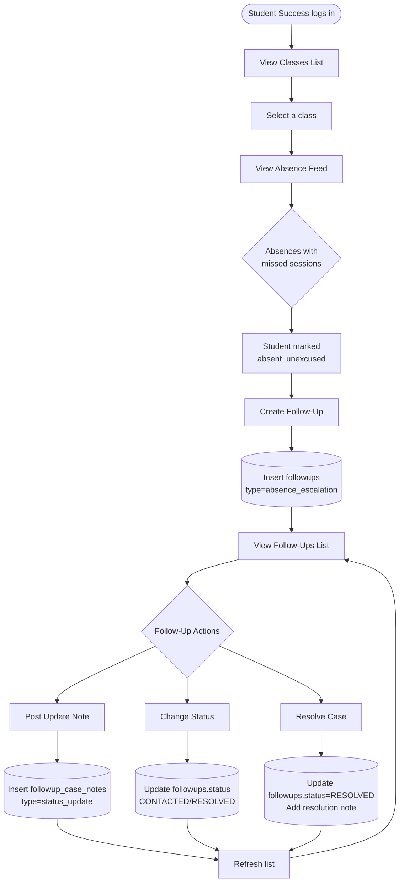
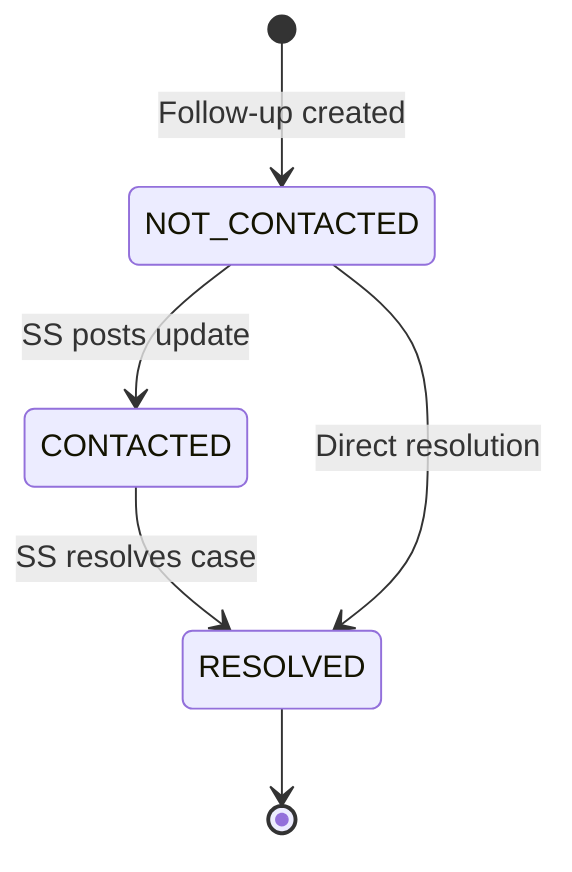

# Student Success Workflow

**Purpose**: Shows Student Success role's workflow for absence tracking and follow-ups.

**Evidence Sources**:
- `frontend/src/pages/StudentSuccessDashboard.tsx` - Student Success UI
- `internal/handlers/api.go` - API handlers
- `migrations/029_create_followups_table.sql` - followups table
- `cmd/server/main.go` - Route definitions

---

## Absence Follow-Up Workflow

---

## Evidence

### View Classes List
**Route**: `GET /api/student-success/classes`  
**Handler**: `apiHandler.GetStudentSuccessClasses`  
**Returns**: List of all classes (Student Success sees all classes)  
**Evidence**:
- `cmd/server/main.go:286-297`
- `internal/handlers/api.go` - GetStudentSuccessClasses function

### View Absence Feed
**Route**: `GET /api/student-success/class/absence-feed?class_key={key}`  
**Handler**: `apiHandler.GetAbsenceFeed`  
**Returns**: Students with missed sessions in selected class  
**Database**: Queries `attendance` WHERE status = 'absent_unexcused'  
**Evidence**:
- `cmd/server/main.go:312-315`
- `internal/handlers/api.go` - GetAbsenceFeed function
- `migrations/017_create_attendance.sql`

### Create Follow-Up
**Route**: `POST /api/student-success/followups`  
**Handler**: `apiHandler.CreateFollowUp`  
**Payload**: `{ class_key, lead_id, session_number, note, status }`  
**Database**: Inserts `followups` WHERE type = 'absence_escalation'  
**Evidence**:
- `cmd/server/main.go:317-326`
- `migrations/029_create_followups_table.sql:2-13`
- `internal/handlers/api.go` - CreateFollowUp function

### View Follow-Ups List
**Route**: `GET /api/student-success/followups?class_key={key}`  
**Handler**: `apiHandler.GetFollowUps`  
**Returns**: List of active follow-ups for a class  
**Database**: Queries `followups` WHERE type = 'absence_escalation' AND class_key = {key}  
**Evidence**:
- `cmd/server/main.go:317-326`
- `internal/handlers/api.go` - GetFollowUps function

### Post Update Note
**Route**: `POST /api/absence-cases/:id/follow-up`  
**Handler**: `apiHandler.PostFollowUpUpdate`  
**Payload**: `{ note_text, new_status }`  
**Database**: Inserts `followup_case_notes` with note_type = 'status_update'  
**Evidence**:
- `cmd/server/main.go:377-389`
- `migrations/034_create_followup_case_notes.sql`
- `internal/handlers/api.go` - PostFollowUpUpdate function

### Resolve Case
**Route**: `POST /api/absence-cases/:id/resolve` or `POST /api/student-success/resolve-absence`  
**Handler**: `apiHandler.ResolveFollowUp` or `apiHandler.ResolveAbsence`  
**Payload**: `{ resolution_note }`  
**Database**: 
- Updates `followups.status = 'RESOLVED'`
- Inserts `followup_case_notes` with note_type = 'resolution'  
**Evidence**:
- `cmd/server/main.go:328-331`, `377-389`
- `internal/handlers/api.go` - ResolveFollowUp, ResolveAbsence functions

---

## Follow-Up Status Lifecycle

### Evidence:
- `migrations/029_create_followups_table.sql:8` - status field with CHECK constraint
- `followups.status` values: NOT_CONTACTED, CONTACTED, RESOLVED

---

## Key Business Rules

### Rule: Follow-up created per absence
**Trigger**: Student marked as `absent_unexcused` by mentor  
**Action**: Student Success creates follow-up from absence feed  
**Constraint**: `UNIQUE (class_key, lead_id, session_number)` prevents duplicate follow-ups  
**Evidence**: `migrations/029_create_followups_table.sql:12`

### Rule: Session tracking for escalations
**Purpose**: Track which session student missed  
**Field**: `followups.session_number` (NOT NULL for absence escalations)  
**Evidence**: `migrations/029_create_followups_table.sql:6`

### Rule: Shared access with Mentor Head
**Routes**: Absence feed, follow-ups, resolve actions  
**Roles**: student_success, mentor_head, admin  
**Why**: Mentor Head needs visibility into student issues  
**Evidence**: `cmd/server/main.go:312-389` - RequireAnyRole checks include both roles

### Rule: Case notes for audit trail
**Purpose**: Track all updates/resolutions for a follow-up case  
**Table**: `followup_case_notes`  
**Types**: `status_update` (general note), `resolution` (case closed)  
**Evidence**: `migrations/034_create_followup_case_notes.sql`

---

## Open Questions

- [ ] **Automatic follow-up creation**: Is follow-up created automatically when absence is marked, or does SS manually create it? *(check handler logic)*
- [ ] **Escalation rules**: Are there escalation rules (e.g., 3+ absences → alert)? *(check business logic)*
- [ ] **Re-open resolved case**: Can a resolved follow-up be re-opened? *(check UI/handler validation)*
- [ ] **Notification system**: Does SS get notified of new absences? *(check for notification mechanism)*
- [x] **Late joiner alerts**: Student Success now receives dashboard banner alerts for new late joiners to help awareness (implemented 2026-02-01).
