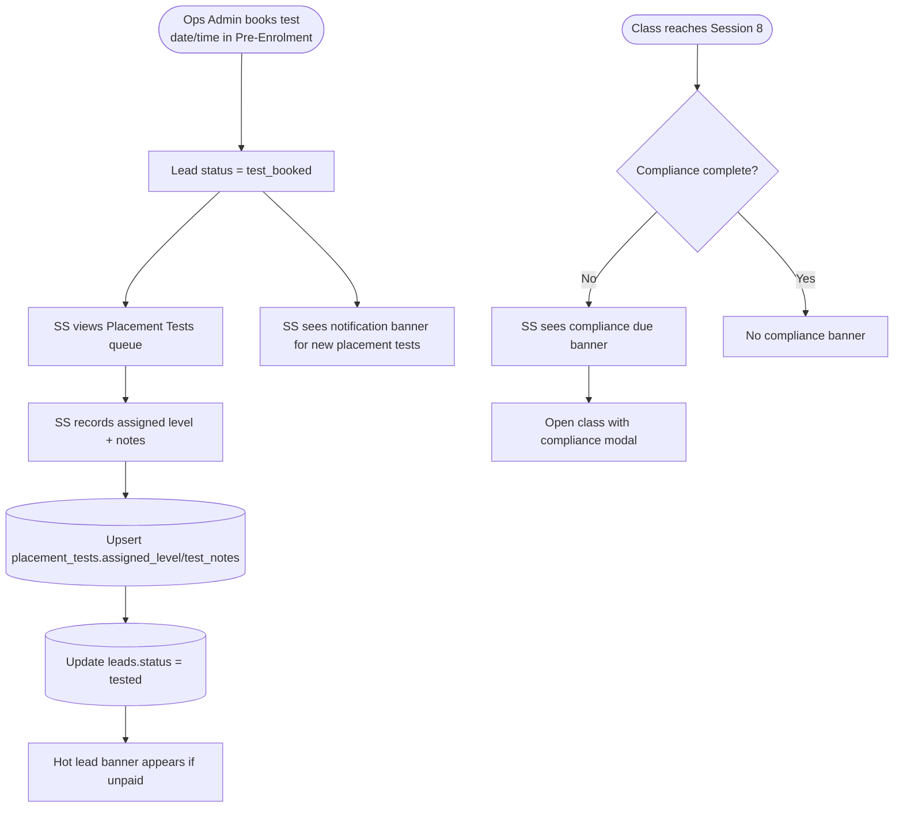
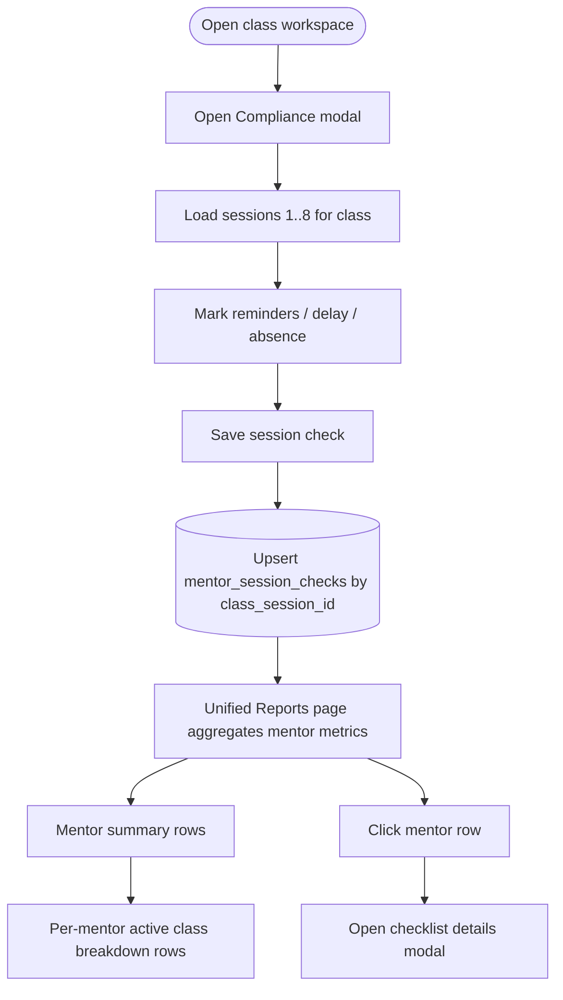
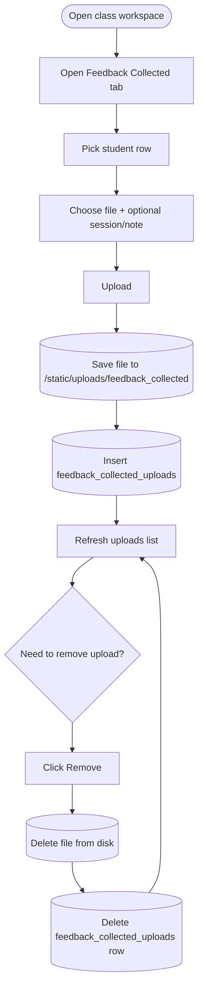
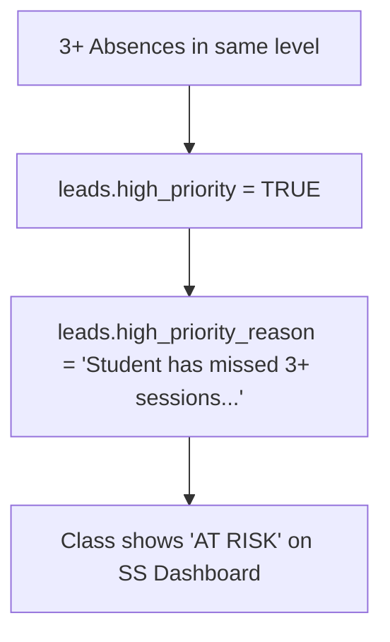
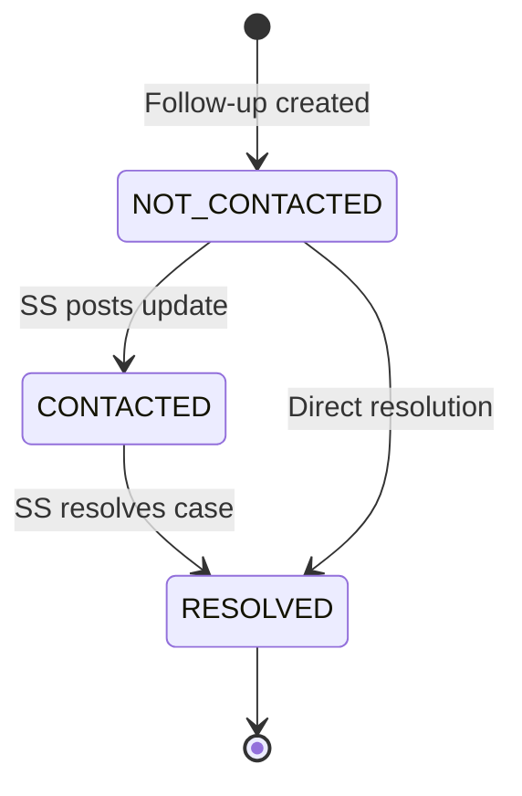

# Student Success Workflow

**Purpose**: Shows Student Success role's workflow for absence tracking and follow-ups.

**Evidence Sources**:
- `frontend/src/pages/StudentSuccessDashboard.tsx` - Student Success UI
- `frontend/src/pages/StudentSuccessClass.tsx` - Feedback collected tab UI
- `internal/handlers/api.go` - API handlers
- `migrations/029_create_followups_table.sql` - followups table
- `migrations/040_create_feedback_collected_uploads.sql` - feedback uploads table
- `cmd/server/main.go` - Route definitions

---

## Absence Follow-Up Workflow


---

## Placement Test Results Workflow (Student Success)



## Mentor Compliance Workflow (Student Success only)



---

## Feedback Collected Uploads (Student Success only; Mentor Head read-only)



---

## Dashboard Feedback Notifications

**Rule**: Mid-round and end-round feedback banners are shown on the Student Success dashboard (not inside class tabs).  
**Behavior**:
- Mid-round banner shows when Session 4 reached and not all S4 feedback is submitted.
- End-round banner shows when Session 8 reached and not all S8 feedback is submitted.
- Each banner links to the class feedback tab.  
**Evidence**:
- `frontend/src/pages/StudentSuccessDashboard.tsx`
- `internal/handlers/api.go` (GetStudentSuccessClasses computes milestone flags)

---

## Mentor Head Read-Only Class Review (Active + Closed)

```mermaid
flowchart TD
    Start([Mentor Head dashboard]) --> OpenClass[Open class detail]
    OpenClass --> ViewTabs[View Students / Absence / Follow-ups / Feedback / Feedback Collected / Final Grading]
    ViewTabs --> ArchiveView[Closed classes allowed (read-only review)]
```

**Notes**
- Mentor Head primarily reviews classes via the Class Workspace (Sessions & Attendance + Final Grading + Feedback Collected).
- Closed classes are allowed for Mentor Head; student roster is sourced from archived enrollments.

---

## Evidence

### View Placement Tests Queue
**Route**: `GET /api/student-success/placement-tests`  
**Handler**: `apiHandler.GetStudentSuccessPlacementTests`  
**Returns**: Leads with test date/time set and **no assigned level yet** by default; supports `show_completed=1` to return completed tests  
**Evidence**:
- `cmd/server/main.go` - route registration
- `internal/handlers/api.go` - GetStudentSuccessPlacementTests
- `internal/models/repository.go` - GetPlacementTestsForStudentSuccess

### Record Placement Test Result
**Route**: `POST /api/student-success/placement-tests/complete`  
**Handler**: `apiHandler.CompletePlacementTest`  
**Behavior**:
- Saves `assigned_level` + `test_notes` in `placement_tests`
- Sets `leads.status = tested` **only if** current status is `lead_created` or `test_booked`  
**Evidence**:
- `internal/handlers/api.go` - CompletePlacementTest
- `internal/models/repository.go` - UpdatePlacementTest, UpdateLeadStatus

### Feedback Collected Uploads
**Routes**:
- `GET /api/student-success/feedback-collected?class_key=...` (list uploads)
- `POST /api/student-success/feedback-collected` (upload)
- `DELETE /api/student-success/feedback-collected/:id` (remove)
**Handlers**: `GetFeedbackCollected`, `UploadFeedbackCollected`, `DeleteFeedbackCollected`  
**Permissions**:
- View: student_success, mentor_head, admin
- Upload/Delete: student_success only
**Database**: `feedback_collected_uploads`  
**Evidence**:
- `cmd/server/main.go` - route registrations
- `internal/handlers/api.go` - feedback collected handlers
- `internal/models/repository.go` - Create/Get/Delete feedback uploads
- `migrations/040_create_feedback_collected_uploads.sql`

### Mentor Head Read-Only Class Detail
**Route**: `GET /api/student-success/class?class_key=...`  
**Permissions**: student_success, mentor_head, admin  
**Behavior**:
- Mentor Head can view active and closed classes
- Closed classes use archived enrollments for the student list  
**Evidence**:
- `cmd/server/main.go` - route registration
- `internal/handlers/api.go` - GetStudentSuccessClass
- `internal/models/repository.go` - GetStudentSuccessClassDetail

### Mentor Compliance APIs
**Routes**:
- `POST /api/compliance/check` (upsert one session check)
- `GET /api/compliance/class/:class_key` (8-session grid payload)
- `GET /api/reports/mentors` (mentor-level aggregates)
**Permissions**:
- Compliance write/read: student_success only
- Reports: student_success, mentor_head, admin, manager
**Evidence**:
- `cmd/server/main.go`
- `internal/handlers/api.go`
- `internal/models/compliance.go`

### Compliance Due Banner (Student Success dashboard)
**Source**: `GET /api/student-success/classes` includes `compliance_required`, `compliance_done`, `compliance_total` per class.  
**Rule**: Banner appears for classes where Session 8 is completed and checklist isn't complete.  
**Navigation**: Banner action opens `/student-success/class?class_key=...&open_compliance=1`.  
**Evidence**:
- `internal/handlers/api.go` (`GetStudentSuccessClasses`)
- `frontend/src/pages/StudentSuccessDashboard.tsx`
- `frontend/src/pages/StudentSuccessClass.tsx`

### Test Booking (Ops Admin)
**Route**: `POST /pre-enrolment/:id` (Save)  
**Behavior**:
- Saves test date/time/type  
- Auto-sets status to `test_booked` when date + time exist  
**Evidence**:
- `internal/handlers/pre_enrolment.go` - SaveFull
- `internal/models/repository.go` - ComputeStageFromFormCompletion

## Evidence

### View Classes List
**Route**: `GET /api/student-success/classes`  
**Handler**: `apiHandler.GetStudentSuccessClasses`  
**Returns**: List of all classes (Student Success sees all classes)  
**Evidence**:
- `cmd/server/main.go:286-297`
- `internal/handlers/api.go` - GetStudentSuccessClasses function
- `internal/handlers/community_officer.go` - banner UX for server-rendered SS dashboard

### View Absence Feed
**Route**: `GET /api/student-success/class/absence-feed?class_key={key}`  
**Handler**: `apiHandler.GetAbsenceFeed`  
**Returns**: Students with missed sessions in selected class  
**Database**: Queries `attendance` WHERE status = 'absent_unexcused'  
**Evidence**:
- `cmd/server/main.go:312-315`
- `internal/handlers/api.go` - GetAbsenceFeed function
- `migrations/017_create_attendance.sql`

### Create Follow-Up
**Route**: `POST /api/student-success/followups`  
**Handler**: `apiHandler.CreateFollowUp`  
**Payload**: `{ class_key, lead_id, session_number, note, status }`  
**Database**: Inserts `followups` WHERE type = 'absence_escalation'  
**Evidence**:
- `cmd/server/main.go:317-326`
- `migrations/029_create_followups_table.sql:2-13`
- `internal/handlers/api.go` - CreateFollowUp function

### View Follow-Ups List
**Route**: `GET /api/student-success/followups?class_key={key}`  
**Handler**: `apiHandler.GetFollowUps`  
**Returns**: List of active follow-ups for a class  
**Database**: Queries `followups` WHERE type = 'absence_escalation' AND class_key = {key}  
**Evidence**:
- `cmd/server/main.go:317-326`
- `internal/handlers/api.go` - GetFollowUps function

### Post Update Note
**Route**: `POST /api/absence-cases/:id/follow-up`  
**Handler**: `apiHandler.PostFollowUpUpdate`  
**Payload**: `{ note_text, new_status }`  
**Database**: Inserts `followup_case_notes` with note_type = 'status_update'  
**Evidence**:
- `cmd/server/main.go:377-389`
- `migrations/034_create_followup_case_notes.sql`
- `internal/handlers/api.go` - PostFollowUpUpdate function

### Resolve Case
**Route**: `POST /api/absence-cases/:id/resolve` or `POST /api/student-success/resolve-absence`  
**Handler**: `apiHandler.ResolveFollowUp` or `apiHandler.ResolveAbsence`  
**Payload**: `{ resolution_note }`  
**Database**: 
- Updates `followups.status = 'RESOLVED'`
- Inserts `followup_case_notes` with note_type = 'resolution'  
**Evidence**:
- `cmd/server/main.go:328-331`, `377-389`
- `internal/handlers/api.go` - ResolveFollowUp, ResolveAbsence functions

---

## Escalation & "At Risk" Logic

**Rule**: A class is marked **🚩 AT RISK** on the dashboard if any student in that class has a high priority flag.



**Trigger**:
- High priority is automatically set via `UpdateAbsencePriority` in `internal/models/repository.go` whenever attendance is marked.

**Visibility**:
- SS Dashboard shows the badge for all active classes with one or more high-priority students.

---

## Follow-Up Status Lifecycle



### Evidence:
- `migrations/029_create_followups_table.sql:8` - status field with CHECK constraint
- `followups.status` values: NOT_CONTACTED, CONTACTED, RESOLVED

---

## Key Business Rules

### Rule: Follow-up created per absence
**Trigger**: Student marked as `absent_unexcused` by mentor  
**Action**: Student Success creates follow-up from absence feed  
**Constraint**: `UNIQUE (class_key, lead_id, session_number)` prevents duplicate follow-ups  
**Evidence**: `migrations/029_create_followups_table.sql:12`

### Rule: Session tracking for escalations
**Purpose**: Track which session student missed  
**Field**: `followups.session_number` (NOT NULL for absence escalations)  
**Evidence**: `migrations/029_create_followups_table.sql:6`

### Rule: Shared access with Mentor Head
**Routes**: Absence feed, follow-ups, resolve actions  
**Roles**: student_success, mentor_head, admin  
**Why**: Mentor Head needs visibility into student issues  
**Evidence**: `cmd/server/main.go:312-389` - RequireAnyRole checks include both roles

### Rule: Student Success dashboard uses banner UX
**Scope**: `/student-success` (server-rendered)  
**Behavior**: Handler redirects with `?error=...` or `?success=...` and template renders a banner  
**Evidence**:
- `internal/handlers/community_officer.go`
- `internal/views/student_success.html`

### Rule: Dashboard tab persistence
**Rule**: The Student Success class view preserves the active tab (Students, Absence, Follow-ups, etc.) on page refresh using URL synchronization.  
**Evidence**: `frontend/src/pages/StudentSuccessClass.tsx`

### Rule: Case notes for audit trail
**Purpose**: Track all updates/resolutions for a follow-up case  
**Table**: `followup_case_notes`  
**Types**: `status_update` (general note), `resolution` (case closed)  
**Evidence**: `migrations/034_create_followup_case_notes.sql`

---

## Open Questions

- [ ] **Automatic follow-up creation**: Is follow-up created automatically when absence is marked, or does SS manually create it? *(check handler logic)*
- [x] **Escalation rules**: Are there escalation rules (e.g., 3+ absences → alert)? **YES**: 3+ absences triggers `high_priority` flag and "AT RISK" dashboard badge.
- [ ] **Re-open resolved case**: Can a resolved follow-up be re-opened? *(check UI/handler validation)*
- [ ] **Notification system**: Does SS get notified of new absences? *(check for notification mechanism)*
- [x] **Late joiner alerts**: Student Success now receives dashboard banner alerts for new late joiners to help awareness (implemented 2026-02-01).
